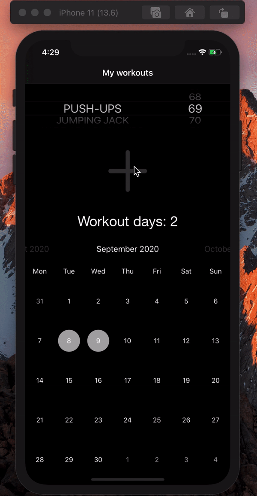
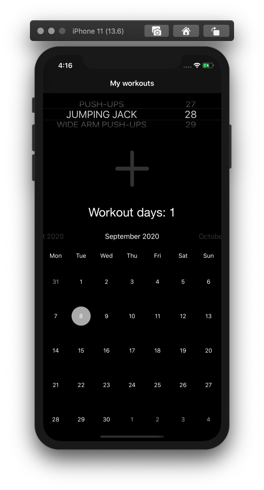
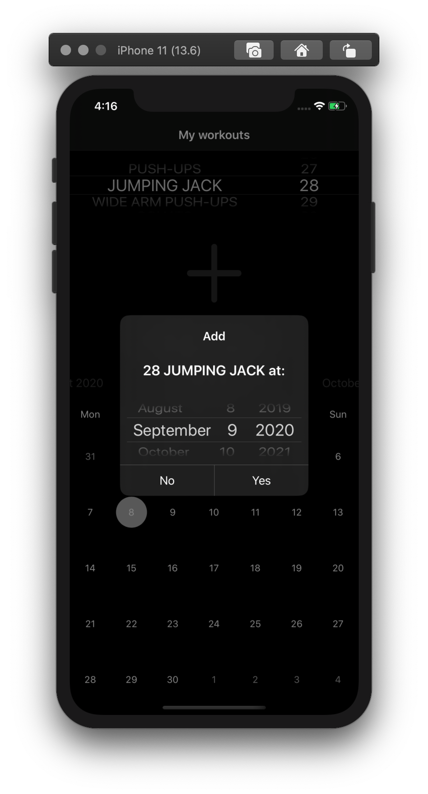
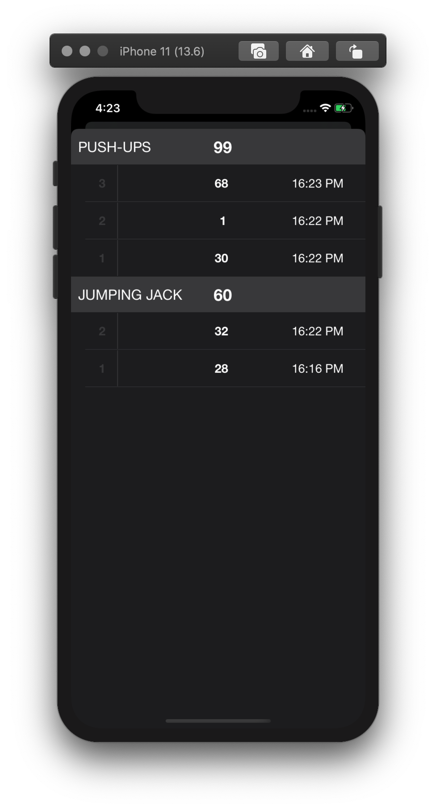

# My-workouts-app

A workouts tracking app.

## Learned

* CoreData (CRUD)
* TableView: custom reusable section header, swipe cell actions
* Custom Alert
* FSCalendar
* UserDefaults
* MVC and Delegate design pattern

